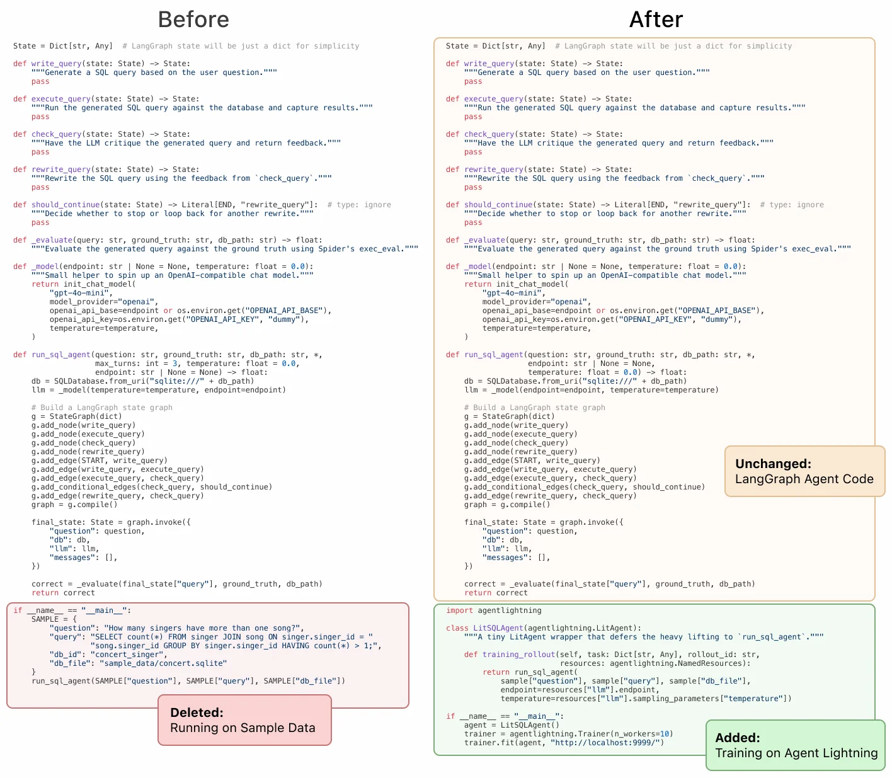
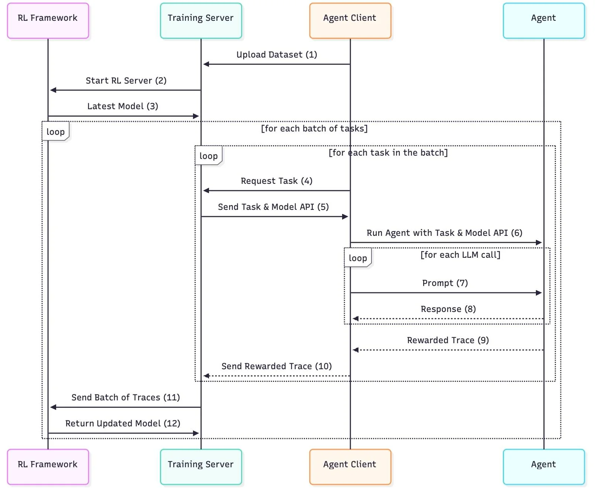

#   中文狼人杀 Agentic-RL 训练案例配置指南
####################################################################
### 基于框架版本信息
#### - agent-lightning:  commit: 5724f63cfc75bcc2f4fb56958ef384d307717c18 | date: Sep 13, 2025 (或者直接pip install -e . 安装本仓库)
#### - AgentScope:        commit: 458e8eedc94bba89bc3e4c6756e35fb4defbc0ac | date: Sep 15, 2025 （截至2025-9-30日的版本 v1.0.4 测试了都是没有api冲突的）
#### - VERL:              version: v0.5.0
#### - VLLM:              version: v0.10.2
#### - flash-attn         version: v2.8.3
### 相关仓库链接
#### - agent-lightning 官方: https://github.com/microsoft/agent-lightning
#### - AgentScope 官方:     https://github.com/agentscope-ai/agentscope
#### - 中文狼人杀修改版:    https://github.com/af-74413592/agentscope
####################################################################
### 数据集 用fake-data.py 生成或者直接下载gsm8k的train.parquert都可以，仅仅起到一个迭代器的作用
####################################################################
### 一、核心执行脚本
1. **训练脚本路径**  
   `example/werewolf/train.sh`

2. **客户端启动命令**  
   `python werewolf_agent.py`

### 二、agent-lightning 源码修改位置（核心改动）(可以直接git clone 本仓库)
#### 2.0 添加examples/werewolf 实现
#### 2.1 注释 Triplet 导出逻辑（防止覆盖）
- 文件路径：`agentlightning/runner.py`  
- 修改位置：第 115 行  
- 原代码（注释掉）：
  ```python
  if trace_spans: 
          triplets = self.triplet_exporter.export(trace_spans)
        ```

#### 2.2 修改 Trace 列表构造（agentlightning/verl/daemon.py 第 338 行）：

```
trace_list = [
                {"prompt_ids": t.prompt.get("token_ids", []), "response_ids": t.response.get("token_ids", []), "reward": t.reward}
                for t in rollout.triplets
            ]
```
#### 2.3 修正 Reward 取值逻辑（第 418 行）：

原代码（注释掉）：

```
reward_list.append(sample_info["reward"])
```

新代码（替换为）：

```
reward_list.append(trace["reward"])
```
#### agentlightning/verl/trainer.py 298行 注释了第一次val函数
```
        # if self.val_reward_fn is not None and self.config.trainer.get("val_before_train", True):
        #     val_metrics = self._validate()
        #     assert val_metrics, f"{val_metrics=}"
        #     pprint(f"Initial validation metrics: {val_metrics}")
        #     logger.log(data=val_metrics, step=self.global_steps)
        #     if self.config.trainer.get("val_only", False):
        #         return
```


### 其他改动
#### agentlightning/runner.py 241行加了重试逻辑和手动最大token限制，可以自行调整，或者注释掉直接传入result

```
result = await rollout_method(task.input, task.rollout_id, resources_update.resources)
valid_result = [t for t in result if len(t.prompt.get("token_ids")) + len(t.response.get("token_ids")) <= 10000]
if len(valid_result) > 64:
   #降低最大rollout
   import random
   new_result = random.sample(valid_result, 64)
# rollout_obj = self._to_rollout_object(result, task.rollout_id)
rollout_obj = self._to_rollout_object(new_result, task.rollout_id)
```

#### agentlightning/daemon.py
```
if n_transition == 0:
        raise Exception("Empty transitions !!!!!!!")
```

#### examples/werewolf/werewolf_agent.py
```
import random
    if random.random() < 0.8:
        agent = ReActAgent(
            name=name,
            sys_prompt=Prompts.system_prompt,
            # model=DashScopeChatModel(
            #     model_name="qwen3-max-preview",
            #     api_key=os.environ["DASHSCOPE_API_KEY"],
            #     enable_thinking=True,
            # ),
            # model=OpenAIChatModel(
            #     model_name="/root/dataDisk/Qwen3-8B",
            #     client_args={"base_url": "http://127.0.0.1:8000/v1"},
            #     api_key="xxx",
            #     stream=False,
            # ),
            model=OpenAIChatModel(
                model_name=llm.model,
                client_args={"base_url": llm.endpoint},
                api_key="xxx",
                stream=False,
            ),
            # formatter=DashScopeMultiAgentFormatter(),
            formatter=OpenAIMultiAgentFormatter(),
        )
    else:
        agent = ReActAgent(
            name=name,
            sys_prompt=Prompts.system_prompt.format(
                player_name=name,
                guidance=getattr(Prompts, f"notes_{role}"),
            ),
            model=DashScopeChatModel(
                model_name="qwen3-max-preview",
                api_key=os.environ["DASHSCOPE_API_KEY"],
                enable_thinking=True,
            ),
            formatter=DashScopeMultiAgentFormatter(),
        )
```
这一段函数引入了外部模型api进行对抗训练。也可以注释掉全都使用vllm客户端

注意如果更改训练模型，记得替换self.tokenizer

### 二、安装agentscope框架 （需要手动修改）
#### 核心修改 手动处理think消息（因为新版vllm不在支持--enable_thinging格式消息返回）
#### src/agentscope/model/_openai_model.py _parse_openai_completion_response函数开头 改为
```
if choice.message.content:
        try:
                thinking_part = choice.message.content.split("<think>")[1].split("</think>")[0]  
                content_part = choice.message.content.split("</think>")[1]  
                content_blocks.append(
                ThinkingBlock(
                        type="thinking",
                        thinking=thinking_part,
                ),
                )
                content_blocks.append(
                TextBlock(
                        type="text",
                        text=content_part,
                ),
                )
        except:
                content_blocks.append(
                TextBlock(
                        type="text",
                        text=response.choices[0].message.content,
                ),
        )
```

### 其他改动（可选）压缩历史消息防止报错
#### 处理过长的prompt：src/agentscope/model/openai_model.py OpenAIChatModel 的__call_ 函数
```
self.tokenizer = AutoTokenizer.from_pretrained("Qwen/Qwen3-8B")
conversations = [{"role":msg["role"], "content":msg["content"][0]['text'] if type(msg["content"]) == list else msg["content"]} for msg in messages]
input_ids = self.tokenizer.apply_chat_template(
        conversations,
        add_generation_prompt=True,
        tokenize=True,
)

while len(input_ids) > 10000: （比maxlen稍微小一点）
        messages[1]["content"][0]['text'] = messages[1]["content"][0]['text'][:150] + '\n...\n' + messages[1]["content"][0]['text'][200:]
        conversations = [{"role":msg["role"], "content":msg["content"][0]['text'] if type(msg["content"]) == list else msg["content"]} for msg in messages]
        input_ids = self.tokenizer.apply_chat_template(
        conversations,
        add_generation_prompt=True,
        tokenize=True,
        )
```

### 三、verlv0.5.0 改动 (需要手动修改)
#### 注释掉 verl trainer/ppo/ray_trainer.py 415-418行 （因为不需要很大的train_batch_size）
```
real_train_batch_size = config.data.train_batch_size * config.actor_rollout_ref.rollout.n
        assert real_train_batch_size % minimal_bsz == 0, (
        f"real_train_batch_size ({real_train_batch_size}) must be divisible by minimal possible batch size "
        f"({minimal_bsz})"
        )
```

#### 注释掉 verl trainer/ppo/ray_trainer.py 500 行
```
assert config.data.train_batch_size >= config.actor_rollout_ref.actor.ppo_mini_batch_size
```

### 四、train.sh 说明
data.train_batch_size=1 \
actor_rollout_ref.rollout.n=1 \

这两条可以压小，不需要太多rollout，agentlightning会把轨迹切开重组成新的rollout list

actor_rollout_ref.actor.ppo_mini_batch_size=8 \
actor_rollout_ref.actor.ppo_micro_batch_size_per_gpu=1 \
actor_rollout_ref.rollout.log_prob_micro_batch_size_per_gpu=1 \
actor_rollout_ref.ref.log_prob_micro_batch_size_per_gpu=1 \

压小了batchsize

data.max_prompt_length=12288 \
data.max_response_length=1024 \

过长训练会炸掉，过短推理上下文不够

actor_rollout_ref.rollout.gpu_memory_utilization=0.4 \

4:6 分配推理和训练显存

trainer.save_freq=1 \

稳定了可以加大保存频率

trainer.test_freq=0 \ 

没有实现val方法，统计reward移动至train

超长序列可以尝试开启 actor_rollout_ref.actor.ulysses_sequence_parallel_size=2

#################################################


# Agent Lightning⚡

[](https://github.com/microsoft/agent-lightning/actions/workflows/tests.yml)
[](https://github.com/microsoft/agent-lightning/actions/workflows/examples.yml)
[](https://badge.fury.io/py/agentlightning)
[](LICENSE)
[](https://discord.gg/RYk7CdvDR7)

**The absolute trainer to light up AI agents.**

Join our [Discord community](https://discord.gg/RYk7CdvDR7) to connect with other users and contributors.

## ⚡ Core Features

- Turn your agent into an optimizable beast with **ZERO CODE CHANGE** (almost)! 💤
- Build with **ANY** agent framework (LangChain, OpenAI Agent SDK, AutoGen, CrewAI, ...); or even WITHOUT agent framework (Python OpenAI). You name it! 🤖
- **Selectively** optimize one or more agents in a multi-agent system. 🎯
- Embraces Reinforcement Learning, Automatic Prompt Optimization and more **algorithms**. 🤗



## ⚡ Resources

- 8/11/2025 [Training AI Agents to Write and Self-correct SQL with Reinforcement Learning](https://medium.com/@yugez/training-ai-agents-to-write-and-self-correct-sql-with-reinforcement-learning-571ed31281ad) Medium.
- 8/5/2025 [Agent Lightning: Train ANY AI Agents with Reinforcement Learning](https://arxiv.org/abs/2508.03680) arXiv paper.
- 7/26/2025 [We discovered an approach to train any AI agent with RL, with (almost) zero code changes.](https://www.reddit.com/r/LocalLLaMA/comments/1m9m670/we_discovered_an_approach_to_train_any_ai_agent/) Reddit.
- 6/6/2025 [Agent Lightning - Microsoft Research](https://www.microsoft.com/en-us/research/project/agent-lightning/) Project page.

## ⚡ Installation

First, let's get your environment set up. We'll be using `/path/to/agentlightning` to refer to the directory containing this README file.

### 1. Set Up Your Environment

We strongly recommend creating a new virtual environment to avoid conflicts with other packages. You can use either `conda` or `venv`. **Python 3.10 or later** is recommended.

### 2. Install Core Training Dependencies (Optional)

If you are running RL with Agent-Lightning, the next step is to install the essential packages: `PyTorch`, `FlashAttention`, `vLLM` and `VERL`. The following versions and installation order have been tested and are confirmed to work.

```bash
pip install torch==2.7.0 torchvision==0.22.0 torchaudio==2.7.0 --index-url https://download.pytorch.org/whl/cu128
pip install flash-attn --no-build-isolation
pip install vllm==0.9.2
pip install verl==0.5.0
```

See `scripts/setup_stable_gpu.sh` for a full installation script.

### 3. Install Agent Lightning

Now, you're ready to install Agent Lightning itself.

```bash
pip install agentlightning
```

### 4. Install Agent Frameworks (Optional)

If you plan to use other agent frameworks, you can install them with the following commands. If you don't need these, feel free to skip this step.
We recommend doing this as the final step to avoid dependency versions being overwritten by mistake.

```bash
# AutoGen (Recommended to install first)
pip install "autogen-agentchat" "autogen-ext[openai]"

# LiteLLM
pip install "litellm[proxy]"

# MCP
pip install mcp

# UV
pip install uv

# OpenAI Agents
pip install openai-agents

# LangChain
pip install langgraph "langchain[openai]" langchain-community langchain-text-splitters

# SQL-related dependencies
pip install sqlparse nltk
```

Don't worry if dependency conflicts arise during this step. Follow the installation order above and the conflicts generally do not matter.

## ⚡ Examples

For more detailed examples, please see the `examples` folder:

1. [calc_x](examples/calc_x): An agent built with AutoGen with calculator tool use, trained on Calc-X dataset with Reinforcement Learning.
2. [spider](examples/spider): A write-check-rewrite looped agent with LangGraph with SQL execution; selectively optimize write and rewrite on Spider dataset with Reinforcement Learning.
3. [apo](examples/apo): An example to customize an optimization algorithm: Automatic Prompt Optimization.

## ⚡ Important Caveats

1.  **AgentOps Integration**: Agent Lightning uses [AgentOps](https://github.com/AgentOps-AI/agentops) for agent tracking by default. If you're already using AgentOps in your own code, you'll need to disable our managed AgentOps client by modifying the `tracer` parameter of trainer.
2.  **Debugging Traces**: If you encounter issues with tracing, you can visualize the trace tree using `tracer.last_trace().visualize("tree_graph")`. Please note that this API is experimental and may change in future releases.
3.  **Launching the Server and Agents**: Currently, the training server and agent clients must be launched in separate processes. You can open two terminal windows or run one of them in the background. The launching order generally doesn't matter.
4.  **Environment Variables**: The environment variables and working directory at the time of `ray init` are important. If you run into "file not found" errors, try restarting Ray from your current working directory.
5.  **Handling Timeouts**: The training server may hang if samples fail or time out on the agent side. To prevent this, we recommend setting limits on the prompt and response lengths, as this is the most common cause of failures.
6.  **VERL Failures**: Save checkpoints frequently, as VERL with vLLM may sometimes experience out-of-memory issues. If you encounter a VERL failure, you can resume training from the last checkpoint.

## ⚡ Architecture

Currently, Agent Lightning is built around a **training server** and one or multiple **agents**.

* The **server** manages the training data, prepares samples for the agents, and provides the LLM endpoint.
* **Agents** retrieve samples from the server, process them (which may involve interacting with the LLM), and send the results back. These results, or "trajectories," are lists of prompts and responses from the LLM.
* The **server** then collects these trajectories and computes the losses to optimize the language models.



## ⚡ Development Instructions

Install with development dependencies:

```
git clone https://github.com/microsoft/agent-lightning
cd agent-lightning
pip install -e .[dev]
```

Please run pre-commit hooks before checking in code:

```
pre-commit install
pre-commit run --all-files --show-diff-on-failure --color=always
```

Serve documentation locally:

```bash
mkdocs serve
```

## ⚡ Citation

If you find Agent Lightning useful in your research or projects, please cite our paper:

```bibtex
@misc{luo2025agentlightningtrainai,
      title={Agent Lightning: Train ANY AI Agents with Reinforcement Learning}, 
      author={Xufang Luo and Yuge Zhang and Zhiyuan He and Zilong Wang and Siyun Zhao and Dongsheng Li and Luna K. Qiu and Yuqing Yang},
      year={2025},
      eprint={2508.03680},
      archivePrefix={arXiv},
      primaryClass={cs.AI},
      url={https://arxiv.org/abs/2508.03680}, 
}
```

## ⚡ Contributing

This project welcomes contributions and suggestions. Most contributions require you to agree to a Contributor License Agreement (CLA) declaring that you have the right to, and actually do, grant us the rights to use your contribution. For details, visit https://cla.opensource.microsoft.com.

When you submit a pull request, a CLA bot will automatically determine whether you need to provide a CLA and decorate the PR appropriately (e.g., status check, comment). Simply follow the instructions provided by the bot. You will only need to do this once across all repos using our CLA.

This project has adopted the [Microsoft Open Source Code of Conduct](https://opensource.microsoft.com/codeofconduct/). For more information see the [Code of Conduct FAQ](https://opensource.microsoft.com/codeofconduct/faq/) or contact [opencode@microsoft.com](mailto:opencode@microsoft.com) with any additional questions or comments.

## ⚡ Trademarks

This project may contain trademarks or logos for projects, products, or services. Authorized use of Microsoft trademarks or logos is subject to and must follow [Microsoft's Trademark & Brand Guidelines](https://www.microsoft.com/en-us/legal/intellectualproperty/trademarks/usage/general). Use of Microsoft trademarks or logos in modified versions of this project must not cause confusion or imply Microsoft sponsorship. Any use of third-party trademarks or logos are subject to those third-party's policies.

## ⚡ Responsible AI

This project has been evaluated and certified to comply with the Microsoft Responsible AI Standard. The team will continue to monitor and maintain the repository, addressing any severe issues, including potential harms, if they arise.

## ⚡ License

This project is licensed under the MIT License. See the [LICENSE](LICENSE) file for details.
